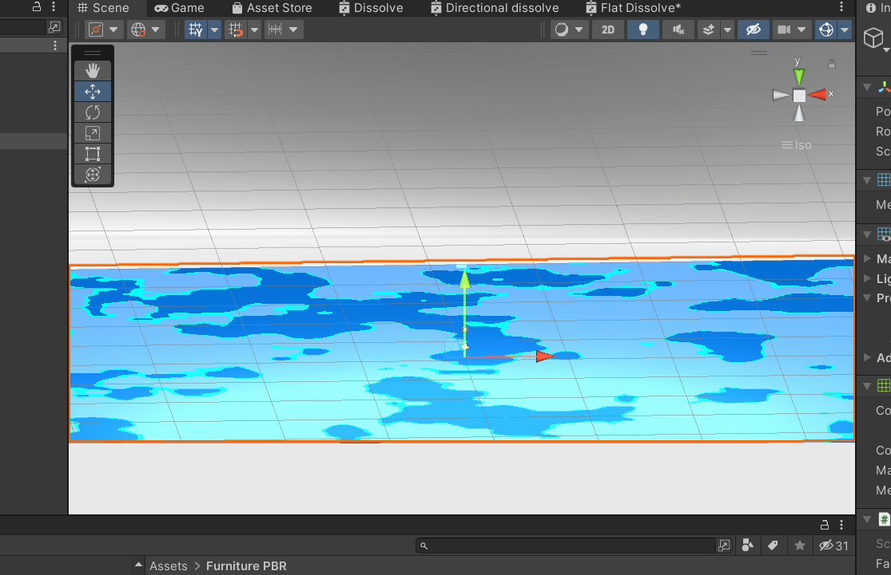

# Dissolve - shader graph

Window > Package manager, install "High Definition RP". （OR Universal RP）

shader ->PBR shader

.png>)

\--------------



switch to android platform and download package manager -> Universal RP + shader graph

**right click-> create- > rendering -> universal render pipeline -> pipeline assets(Forward render)**

URP pipeline assets. create and drag URP in Graphics under project setting accordingly

.png>)

SRP Batcher disabled for now

.png>)

